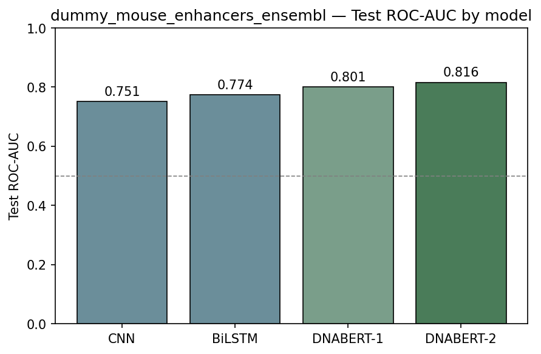

# dc-genomics-review

**Standalone review repo for DeepChem genomic sequence support.**

A minimal, PR-review-ready repository that demonstrates a complete DeepChem-style genomics pipeline: featurizer → loader → model → evaluation. Designed for a DeepChem maintainer to scan in one sitting.

**Full results & proposal:** All benchmark details and interpretation → **[docs/RESULTS.md](docs/RESULTS.md)**. **GSoC final proposal** → **[docs/GSoC_PROPOSAL_FINAL.md](docs/GSoC_PROPOSAL_FINAL.md)**.

### Key results

On **dummy_mouse_enhancers_ensembl** (1.2K sequences), DNABERT-2 reaches **0.816 test ROC-AUC** (best of four models); on **human_nontata_promoters**, Random Forest reaches **0.98** and DNABERT-2 **0.966** test ROC-AUC with one epoch.




## Quick Start

For full reproduction (loader and benchmark runs), install with data extras so `genomic-benchmarks` is available: `pip install -e ".[data]"` or `pip install -e ".[all]"`. Otherwise loader tests and pipeline runs may hit import errors.

```bash
git clone <this-repo-url>
cd dc-genomics-review
pip install -e .
# For loader + benchmarks: pip install -e ".[data]"  or  pip install -e ".[all]"

# Run featurizer tests (fast, no network)
pytest tests/test_featurizers.py -v

# Run all offline tests
pytest tests/ -v -m "not slow"

# Run full test suite (requires network for dataset/model downloads)
pytest tests/ -v
```

## Example usage

Load a Genomic Benchmarks dataset, then either train a **Random Forest** on k-mer features or fine-tune **DNABERT-2** on raw sequences (from [examples/tutorial.ipynb](examples/tutorial.ipynb)):

```python
import deepchem as dc
from genomics.loader import load_genomic_benchmark
from genomics.featurizers import DNAKmerCountFeaturizer
from genomics.dnabert2 import DNABERT2Model
from sklearn.ensemble import RandomForestClassifier

# Load with official benchmark splits (raw sequences for DNABERT-2)
tasks, datasets, _ = load_genomic_benchmark(
    dataset_name="human_nontata_promoters",
    featurizer=None,
    splitter="official",
    reload=False,
)
train, test = datasets[0], datasets[-1]

# Option A: Random Forest on 4-mer frequencies
_, kmer_datasets, _ = load_genomic_benchmark(
    dataset_name="human_nontata_promoters",
    featurizer=DNAKmerCountFeaturizer(k=4),
    splitter="official",
    reload=False,
)
rf = dc.models.SklearnModel(RandomForestClassifier(n_estimators=100))
rf.fit(kmer_datasets[0])
metric = dc.metrics.Metric(dc.metrics.roc_auc_score, mode="classification")
print("RF Test ROC-AUC:", rf.evaluate(kmer_datasets[-1], [metric])["roc_auc_score"])

# Option B: DNABERT-2 (raw sequences, BPE inside model)
bert = DNABERT2Model(task="classification", n_tasks=1, model_dir="./dnabert2_ckpt",
                     batch_size=4, max_seq_length=128, learning_rate=2e-5)
bert.fit(train, nb_epoch=1)
print("DNABERT-2 Test ROC-AUC:", bert.evaluate(test, [metric], n_classes=2)[metric.name])
```

## Pipeline Overview

```
Raw DNA sequences (FASTA / CSV / GenomicsBenchmarks)
        │
        ▼
[1] Loader (load_genomic_benchmark)
        │   Downloads via genomic-benchmarks package
        │   Preserves official benchmark test split
        │   Returns (tasks, datasets, transformers) — MolNet convention
        ▼
[2] Featurizer (DNAOneHotFeaturizer / DNAKmerFeaturizer)
        │   Converts DNA strings → numerical arrays
        │   Subclasses dc.feat.Featurizer
        ▼
[3] Dataset (NumpyDataset)
        │   Holds (X, y, w, ids)
        │   Splits validation from official train when needed
        ▼
[4] Model (DNABERT2Model)
        │   Subclasses dc.models.torch_models.HuggingFaceModel
        │   BPE tokenization in _prepare_batch (like ChemBERTa)
        │   fit(dataset) / predict(dataset) / evaluate(dataset, metrics)
        ▼
[5] Metrics (dc.metrics.Metric)
        ROC-AUC, Accuracy, etc.
```

## Repository Structure

```
dc-genomics-review/
├── README.md                      ← You are here
├── docs/
│   ├── RESULTS.md                 ← Full benchmark results + interpretation
│   └── DEEPCHEM_MAPPING.md        ← File/PR mapping for upstream
├── plot_results.py                ← Matplotlib scripts for result plots
├── plots/                         ← Output of plot_results.py (PNG figures; run plot_results.py)
├── requirements.txt
├── setup.py
├── genomics/
│   ├── __init__.py                ← Public API
│   ├── featurizers.py             ← DNAOneHotFeaturizer + DNAKmerFeaturizer
│   ├── loader.py                  ← _GenomicBenchmarkLoader + load_genomic_benchmark()
│   ├── dnabert2.py                ← DNABERT2Model (HuggingFaceModel subclass)
│   └── run_pipeline.py            ← One canonical end-to-end example
└── tests/
    ├── conftest.py                ← Shared fixtures
    ├── test_featurizers.py        ← 21 featurizer tests
    ├── test_loader.py             ← 8 loader tests
    └── test_dnabert2.py           ← 6 model tests
```

## Design Decisions


| Decision                                                          | Rationale                                                                                                         |
| ----------------------------------------------------------------- | ----------------------------------------------------------------------------------------------------------------- |
| BPE tokenization in model wrapper, not featurizer                 | Matches ChemBERTa pattern. `_prepare_batch` tokenizes raw strings on-the-fly.                                     |
| Preserve official test split                                      | Benchmark semantics matter more than reusing MolNet's default "split one dataset randomly" pattern.               |
| Two featurizers in one file                                       | Share constants (`BASE_TO_INDEX`), both are small. Reviewer sees all featurizer logic in one place.               |
| One model (DNABERT-2) only                                        | Once the pattern is accepted, NucleotideTransformer/MethylBert follows identically. Keeps review surface minimal. |
| `DummyFeaturizer` for transformer models                          | Raw DNA sequences stored in `X`, tokenized at train time. Standard DeepChem HuggingFace pattern.                  |
| Split only the official train set when no validation split exists | Keeps the benchmark's held-out test set untouched while still yielding a train/valid/test tuple.                  |


## References

- Zhou, Z. et al. *DNABERT-2: Efficient Foundation Model and Benchmark for Multi-Species Genome.* arXiv:2306.15006 (2023).
- Ji, Y. et al. *DNABERT.* Bioinformatics 37(15), 2112-2120 (2021).
- Gresova, K. et al. *Genomic Benchmarks.* BMC Genomic Data 24, 25 (2023).

